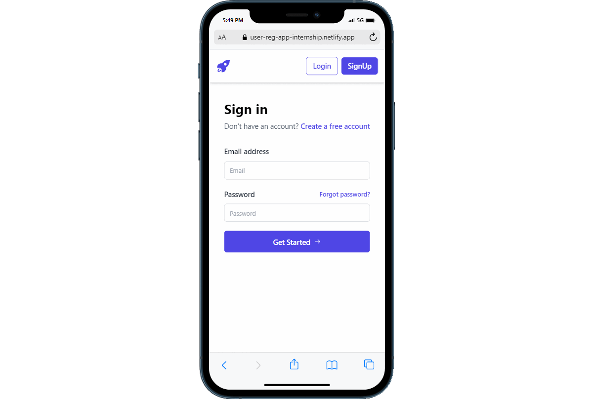

# User Registration App

User registration web application

## 🔗 Deployed Link

### [Live Link](https://user-reg-app-internship.netlify.app/ "Live")

## ✨ Features

- Create account by providing name, email and password
- Log in to the account using email and password
- Forgot password functionality
- Display user information on homepage
- Update User information
- Log out of the application

## 📷 Sreenshots

## 👨🏻‍💻 Tech Used

### Frontend

### Backend

### Tools

### Hosting

